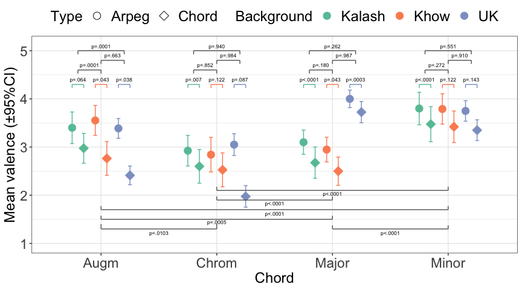

<!-- README.md is generated from README.Rmd. Please edit that file -->

```{r, include = FALSE}
#knitr::opts_chunk$set(
#  collapse = TRUE,
#  comment = "#>",
#  fig.path = "",
#  fig.path = "man/figures/README-",
#  out.width = "75%"
#)
```

# Pakistan chord study (pakistan-chords)

<!-- badges: start -->
<!-- badges: end -->

This repository contains data and analysis concerning study titled "Sweetness is in the Ear of the Beholder: Chord Preference Across Western and Pakistani Listeners" by *AUTHORS*. These files are available at *REMOVED FOR REVIEW*.

## Load the data

```{r initial,message=FALSE,warning=FALSE}
Packages <- c('ggplot2','dplyr','tidyr','lme4','lmerTest','emmeans','pander','MASS')
invisible(lapply(Packages, library, character.only = TRUE)); rm(Packages)

# Suppress summarise info
options(dplyr.summarise.inform = FALSE)

m <- read.csv('data/pakistan_raw_data.csv',header =  TRUE)
m$Type<-factor(m$Type)
m$Instrument<-factor(m$Instrument)
m$Mode<-factor(m$Mode)
m$Background<-factor(m$Background)
m$Gender<-factor(m$Gender)

print(head(m))
length(unique(m$PARTICIPANTID))
knitr::kable(table(m$Background,m$Gender)/16,caption = 'Count of participants per Gender and Region.')
```

## Consistency of ratings

```{r consistency,echo=FALSE,message=FALSE, warning=FALSE,results='asis'}
source('consistency.R')
```

## LMM analysis of valence ratings

```{r LMM1,echo=TRUE,message=FALSE, warning=FALSE,results='asis'}
source('LMM_analysis.R',echo = TRUE)
```

## Figure 1: Visualise means

```{r visualise,echo=TRUE,fig.width=9,fig.height=5,caption='Figure 1. Mean valence ratings across Culture and Type (arpeggio vs. vertical chord) for each chord. The p-values reflect contrast analyses with GLMM with Tukey’s method for adjusting multiple corrections that have been carried out between chords, Type, or Culture.'}
source('figure1.R')
```




# Paired chord comparison task

Create various tables of counts across grouping variables (Instrument, Chord, Culture, Timbre) from the paired choice tasks.

```{r pair_comparison_task,echo=TRUE, message=FALSE, warning=FALSE,results='asis'}
p <- read.csv('data/paired_decision.csv',header =  TRUE)
source('paired_comparisons.R')
```

Report $\chi^2$ tests and Cochran-Mantel-Haenszel tests for comparing counts across grouping variables.

```{r pair_comparison_task_stats,echo=TRUE, message=FALSE, warning=FALSE}
source('paired_comparison_statistics.R')
```

## Figure 2: Visualise major and minor chord with paired selections

```{r figure2,echo=TRUE,fig.width=6,fig.height=4,caption='Figure 2. Mean valence ratings for Major and Minor chords as well as paired comparison preference choice task decisions for the three cultural groups.'}
source('figure2.R') 
```

## Supporting Information

Stimulus analysis and contextualisation of roughness and harmonicity with Durham Chord Dataset (DCD) consisting of all triads and tetrads.

### Establish the context for models using DCD

```{r extras,echo=TRUE,warning=FALSE,message=FALSE,results='asis'}
corpus <- read.csv('data/DCD_predictors.csv') # Load predictors csv data
subset<-dplyr::filter(corpus,numtones<5 & numtones>2 & register==0)
H <- quantile(subset$har_18_harmonicity)
#print(H)

chords4 <- list()
chords4[[1]] <- c(54, 58, 61, 66)
chords4[[2]] <- c(54, 57, 61, 66)
chords4[[3]] <- c(53, 57, 61, 65)
chords4[[4]] <- c(56, 57, 58, 67)

chords4[[1]]

library(incon)

df<-data.frame(Number=1:4,Name=c("Major","Minor","Augm","Chrom"))
for (k in 1:4) {
  x<-incon(x=chords4[[k]],model="hutch_78_roughness")
  df$hutch_78_roughness[k] <- as.numeric(x)
  x<-incon(x=chords4[[k]],model="vass_01_roughness")
  df$vass_01_roughness[k] <- as.numeric(x)
  x<-incon(x=chords4[[k]],model="wang_13_roughness")
  df$wang_13_roughness[k] <- as.numeric(x)
  x<-incon(x=chords4[[k]],model="stolz_15_periodicity")
  df$stolz_15_periodicity[k] <- as.numeric(x)*-1
  x<-incon(x=chords4[[k]],model="har_18_harmonicity")
  df$har_18_harmonicity[k] <- as.numeric(x)
}

#print(knitr::kable(df,digits = 3,caption = 'Roughness and harmonicity model outputs for stimuli.'))

```

### Link quantiles and stimuli

```{r quantable,echo=FALSE,results='asis'}
quant<-NULL
quant$hutch_78_roughness <- quantile(subset$hutch_78_roughness)
quant$vass_01_roughness <- quantile(subset$vass_01_roughness)
quant$stolz_15_periodicity <- quantile(subset$stolz_15_periodicity)
quant$har_18_harmonicity <- quantile(subset$har_18_harmonicity)
quant$wang_13_roughness <- quantile(subset$wang_13_roughness)
quant<-data.frame(quant)

Q<-c('0%','<25%','25-50%','50-75%','>75%')
for (k in 1:4) {
#  print(k)
  df$hutch_78_roughness_Q[k] <- Q[min(which(df$hutch_78_roughness[k] < quant$hutch_78_roughness))]
  df$vass_01_roughness_Q[k] <- Q[min(which(df$vass_01_roughness[k] < quant$vass_01_roughness))]
  df$wang_13_roughness_Q[k] <- Q[min(which(df$wang_13_roughness[k] < quant$wang_13_roughness))]
  df$stolz_15_periodicity_Q[k] <- Q[min(which(df$stolz_15_periodicity[k] < quant$stolz_15_periodicity))]
  df$vass_01_roughness_Q[k] <- Q[min(which(df$vass_01_roughness[k] < quant$vass_01_roughness))]
  df$har_18_harmonicity_Q[k] <- Q[min(which(df$har_18_harmonicity[k] < quant$har_18_harmonicity))]
}

o<-c("Number","Name","hutch_78_roughness","vass_01_roughness","stolz_15_periodicity","har_18_harmonicity","hutch_78_roughness_Q","vass_01_roughness_Q","stolz_15_periodicity_Q","har_18_harmonicity_Q","wang_13_roughness","wang_13_roughness_Q")
os<-c("Number","Name","hutch_78_roughness","hutch_78_roughness_Q","vass_01_roughness","vass_01_roughness_Q","wang_13_roughness","wang_13_roughness_Q","stolz_15_periodicity","stolz_15_periodicity_Q","har_18_harmonicity","har_18_harmonicity_Q")

df2<-dplyr::select(df,all_of(os))
names(df2)[c(4,6,8,10,12)]<-'Q'
names(df2)[3]<-'Hutch_78'
names(df2)[5]<-'Vass_01'
names(df2)[7]<-'Wang_03'
names(df2)[9]<-'Stol_15'
names(df2)[11]<-'Harr_18'

print(knitr::kable(df2,format = 'markdown',digits = 3))
```

### Plot quantiles

```{r plotquantiles,echo=FALSE,fig.width=7,fig.height=3}

#subset_long <- pivot_longer(subset,
#              cols =c("hutch_78_roughness","vass_01_roughness","stolz_15_periodicity","har_18_harmonicity","wang_13_roughness"))
# plot with facet_wrap but... here a simple approach is taken.

quant_y_val<-40
library(ggplot2)
fig1 <-ggplot(subset,aes(hutch_78_roughness))+
  geom_histogram(bins = 35,colour='black',fill='grey80')+
  annotate("text",x = df$hutch_78_roughness,y=c(25,22,19,16),label= df$Name, colour='darkred')+
  annotate("segment",x = df$hutch_78_roughness,xend = df$hutch_78_roughness,y=c(0,0,0,0),yend=c(25,22,19,16),colour='darkred')+
  geom_vline(xintercept = quantile(subset$hutch_78_roughness)[2:4],colour='navyblue',size=1.25,alpha=0.65)+
  annotate("text", x = c(mean(quantile(subset$hutch_78_roughness)[1:2]),mean(quantile(subset$hutch_78_roughness)[2:3]),mean(quantile(subset$hutch_78_roughness)[3:4]),mean(quantile(subset$hutch_78_roughness)[4:5])),y=quant_y_val, colour='navyblue',label = c("<25%","25-50%","50-75%",">75%"), size=3,alpha=0.65)+
  scale_y_continuous(expand = c(0,0.05),limits = c(0,60))+
  theme_bw()
print(fig1)

fig2 <-ggplot(subset,aes(vass_01_roughness))+
  geom_histogram(bins = 35,colour='black',fill='grey80')+
  annotate("text",x = df$vass_01_roughness,y=c(25,22,19,16),label= df$Name, colour='darkred')+
  annotate("segment",x = df$vass_01_roughness,xend = df$vass_01_roughness,y=c(0,0,0,0),yend=c(25,22,19,16),colour='darkred')+
  geom_vline(xintercept = quantile(subset$vass_01_roughness)[2:4],colour='navyblue',size=1.25,alpha=0.65)+
  annotate("text", x = c(mean(quantile(subset$vass_01_roughness)[1:2]),mean(quantile(subset$vass_01_roughness)[2:3]),mean(quantile(subset$vass_01_roughness)[3:4]),mean(quantile(subset$vass_01_roughness)[4:5])),y=quant_y_val, colour='navyblue',label = c("<25%","25-50%","50-75%",">75%"), size=3,alpha=0.65)+
  scale_y_continuous(expand = c(0,0.05),limits = c(0,60))+
  theme_bw()
print(fig2)

fig3 <-ggplot(subset,aes(wang_13_roughness))+
  geom_histogram(bins = 35,colour='black',fill='grey80')+
  annotate("text",x = df$wang_13_roughness,y=c(25,22,19,16),label= df$Name, colour='darkred')+
  annotate("segment",x = df$wang_13_roughness,xend = df$wang_13_roughness,y=c(0,0,0,0),yend=c(25,22,19,16), colour='darkred')+
  geom_vline(xintercept = quantile(subset$wang_13_roughness)[2:4],colour='navyblue',size=1.25,alpha=0.65)+
  annotate("text", x = c(mean(quantile(subset$wang_13_roughness)[1:2]),mean(quantile(subset$wang_13_roughness)[2:3]),mean(quantile(subset$wang_13_roughness)[3:4]),mean(quantile(subset$wang_13_roughness)[4:5])),y=quant_y_val, colour='navyblue',label = c("<25%","25-50%","50-75%",">75%"), size=3,alpha=0.65)+
  scale_y_continuous(expand = c(0,0.05),limits = c(0,60))+
  theme_bw()
print(fig3)

fig4 <-ggplot(subset,aes(stolz_15_periodicity))+
  geom_histogram(bins = 35,colour='black',fill='grey80')+
  annotate("text",x = df$stolz_15_periodicity,y=c(25,22,19,16),label= df$Name, colour='darkred')+
  annotate("segment",x = df$stolz_15_periodicity,xend = df$stolz_15_periodicity,y=c(0,0,0,0),yend=c(25,22,19,16), colour='darkred')+
  geom_vline(xintercept = quantile(subset$stolz_15_periodicity)[2:4],colour='navyblue',size=1.25,alpha=0.65)+
  annotate("text", x = c(mean(quantile(subset$stolz_15_periodicity)[1:2]),mean(quantile(subset$stolz_15_periodicity)[2:3]),mean(quantile(subset$stolz_15_periodicity)[3:4]),mean(quantile(subset$stolz_15_periodicity)[4:5])),y=quant_y_val, colour='navyblue',label = c("<25%","25-50%","50-75%",">75%"), size=3,alpha=0.65)+
  scale_y_continuous(expand = c(0,0.05),limits = c(0,60))+
  theme_bw()
print(fig4)

fig5 <-ggplot(subset,aes(har_18_harmonicity))+
  geom_histogram(bins = 35,colour='black',fill='grey80')+
  annotate("text",x = df$har_18_harmonicity,y=c(25,22,19,16),label= df$Name, colour='darkred')+
  annotate("segment",x = df$har_18_harmonicity,xend = df$har_18_harmonicity,y=c(0,0,0,0),yend=c(25,22,19,16), colour='darkred')+
  geom_vline(xintercept = quantile(subset$har_18_harmonicity)[2:4],colour='navyblue',size=1.25,alpha=0.65)+
  annotate("text", x = c(mean(quantile(subset$har_18_harmonicity)[1:2]),mean(quantile(subset$har_18_harmonicity)[2:3]),mean(quantile(subset$har_18_harmonicity)[3:4]),mean(quantile(subset$har_18_harmonicity)[4:5])),y=quant_y_val, colour='navyblue',label = c("<25%","25-50%","50-75%",">75%"), size=3,alpha=0.65)+
  scale_y_continuous(expand = c(0,0.05),limits = c(0,60))+
  theme_bw()
print(fig5)

```

## Summary of stimulus analyses

* For roughness, Hutchinson and Knopoff's model indicates that our three chords (major, minor, augmented) are not rough (they lie in the 0-25% quartile) but the chromatic cluster is rough (75-100% quantile). The models by Vassilakis and Wang model provides the same results.

* For harmonicity, Stolzenburg and Harrison's models yield results which are similar although not identical to roughness calculations, where our major, minor and augmented and in the highest quantile (>75%) and chromatic cluster on the lowest (<25%) with the exception of Augmented chord being in the 50-75% quantile in Stolzenburg's model. 

Caveat: This analysis was carried out with DCD, not our stimuli, because most of these models are not applicable to audio. That is why we used Wang in the first place (it makes a small difference between Setar and Piano).


