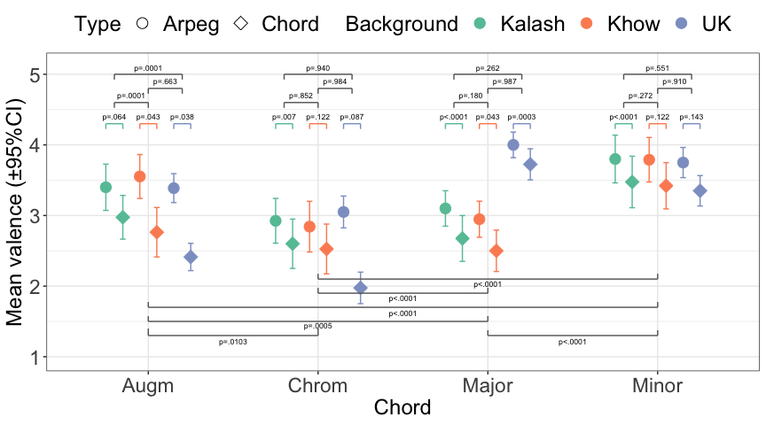
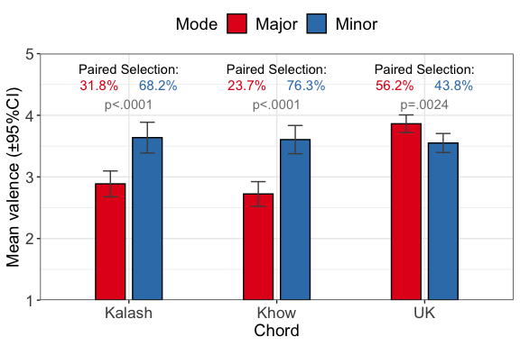
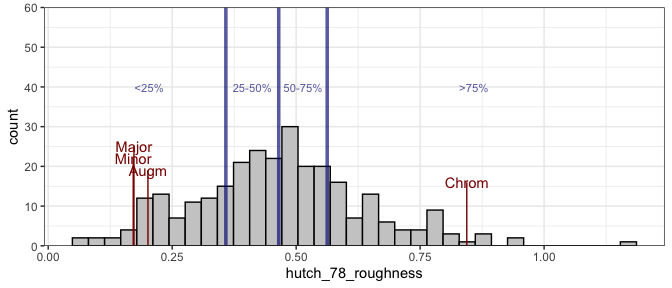
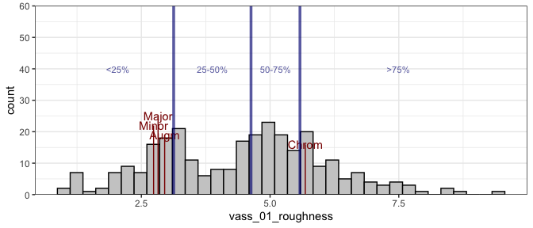
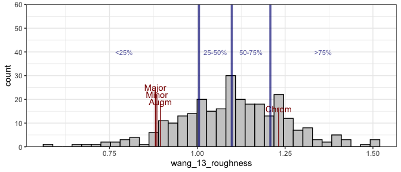
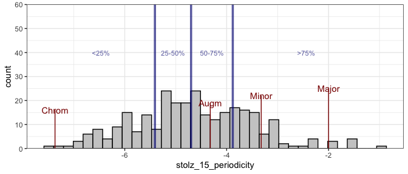
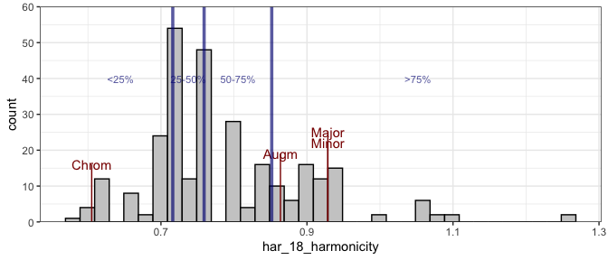

<!-- README.md is generated from README.Rmd. Please edit that file -->

# Pakistan chord study (pakistan-chords)

<!-- badges: start -->
<!-- badges: end -->

This repository contains data and analysis concerning study titled
“Sweetness is in the Ear of the Beholder: Chord Preference Across
Western and Pakistani Listeners” by AUTHORS. These files are available
at REMOVED FOR REVIEW.

## Load the data

``` r
Packages <- c('ggplot2','dplyr','tidyr','lme4','lmerTest','emmeans','pander','MASS')
invisible(lapply(Packages, library, character.only = TRUE)); rm(Packages)

# Suppress summarise info
options(dplyr.summarise.inform = FALSE)

m <- read.csv('data/pakistan_raw_data.csv',header =  TRUE)
m$Type<-factor(m$Type)
m$Instrument<-factor(m$Instrument)
m$Mode<-factor(m$Mode)
m$Background<-factor(m$Background)
m$Gender<-factor(m$Gender)

print(head(m))
#>      PARTICIPANTID variable Rating  Type Instrument  Mode Background Gender
#> 1 MKATLM2407191050  VPCH MJ      3 Chord      Piano Major     Kalash   Male
#> 2 MKAJRD2507191630  VPCH MJ      4 Chord      Piano Major     Kalash   Male
#> 3  MKAAR0108191730  VPCH MJ      4 Chord      Piano Major     Kalash   Male
#> 4 MKASRD0208191600  VPCH MJ      3 Chord      Piano Major     Kalash   Male
#> 5 MKAMRJ0308191400  VPCH MJ      2 Chord      Piano Major     Kalash   Male
#> 6 FKASHR0408191530  VPCH MJ      3 Chord      Piano Major     Kalash Female
length(unique(m$PARTICIPANTID))
#> [1] 79
knitr::kable(table(m$Background,m$Gender)/16,caption = 'Count of participants per Gender and Region.')
```

|        | Female | Male |
|:-------|-------:|-----:|
| Kalash |      2 |   18 |
| Khow   |      0 |   19 |
| UK     |     24 |   16 |

Count of participants per Gender and Region.

## Consistency of ratings

Kalash - alpha: 0.782 Khow - alpha: 0.812 UK - alpha: 0.959

## LMM analysis of valence ratings

``` r
source('LMM_analysis.R',echo = TRUE)
```

> m1 &lt;- lmer(Rating \~ as.numeric(Mode) + as.numeric(Instrument) + +
> as.numeric(Type) + as.numeric(Background) +
> as.numeric(Mode):as.numeric(Backg …. \[TRUNCATED\]

> s &lt;- summary(m1, cor = FALSE)

> rownames(s$coefficients) &lt;- c(“Intercept”, “Chord”, + “Timbre”,
> “Type”, “Culture”, “Chord x Culture”, “Timbre x Culture”, + “Type x
> Cultur …” … \[TRUNCATED\]

> knitr::kable(s$coefficients, digits = 3, caption = “LMM analysis with
> main effects and first order interactions with Culture”)

|                  | Estimate | Std. Error |      df | t value | Pr(&gt;\|t\|) |
|:-----------------|---------:|-----------:|--------:|--------:|--------------:|
| Intercept        |    3.989 |      0.412 | 1218.89 |   9.679 |         0.000 |
| Chord            |    0.012 |      0.073 | 1179.00 |   0.168 |         0.867 |
| Timbre           |   -0.464 |      0.163 | 1179.00 |  -2.850 |         0.004 |
| Type             |   -0.201 |      0.163 | 1179.00 |  -1.234 |         0.217 |
| Culture          |   -0.133 |      0.172 | 1218.89 |  -0.774 |         0.439 |
| Chord x Culture  |    0.100 |      0.030 | 1179.00 |   3.302 |         0.001 |
| Timbre x Culture |    0.115 |      0.068 | 1179.00 |   1.701 |         0.089 |
| Type x Culture   |   -0.157 |      0.068 | 1179.00 |  -2.322 |         0.020 |

LMM analysis with main effects and first order interactions with Culture

> S &lt;- m %&gt;% dplyr::group\_by(Instrument) %&gt;%
> dplyr::summarise(n = n(), + m = mean(Rating, na.rm = TRUE), sd =
> sd(Rating, na.rm = TRUE), + .g …. \[TRUNCATED\]

> mf &lt;- dplyr::filter(m, Mode == “Major” \| Mode == “Minor”)

> mf*M**o**d**e* &lt;  − *f**a**c**t**o**r*(*m**f*Mode)

> m1 &lt;- lmer(Rating \~ Mode \* Background + (1 \| PARTICIPANTID), +
> data = mf)

> em2 &lt;- emmeans(m1, specs = \~Mode \| Background)

> print(knitr::kable(em2, digits = 3, caption = “Comparison of Major vs
> Minor Across Culture.”))

| Mode  | Background | emmean |    SE |      df | lower.CL | upper.CL |
|:------|:-----------|-------:|------:|--------:|---------:|---------:|
| Major | Kalash     |  2.887 | 0.131 | 154.709 |    2.630 |    3.145 |
| Minor | Kalash     |  3.637 | 0.131 | 154.709 |    3.380 |    3.895 |
| Major | Khow       |  2.724 | 0.134 | 154.709 |    2.459 |    2.988 |
| Minor | Khow       |  3.605 | 0.134 | 154.709 |    3.341 |    3.870 |
| Major | UK         |  3.863 | 0.092 | 154.709 |    3.680 |    4.045 |
| Minor | UK         |  3.550 | 0.092 | 154.709 |    3.368 |    3.732 |

Comparison of Major vs Minor Across Culture.

> print(knitr::kable(pairs(em2, digits = 3, caption = “Comparison of
> Major vs Minor Across Culture ( statistics).”)))

| contrast      | Background |   estimate |        SE |  df |   t.ratio |   p.value |
|:--------------|:-----------|-----------:|----------:|----:|----------:|----------:|
| Major - Minor | Kalash     | -0.7500000 | 0.1450752 | 550 | -5.169734 | 0.0000003 |
| Major - Minor | Khow       | -0.8815789 | 0.1488440 | 550 | -5.922840 | 0.0000000 |
| Major - Minor | UK         |  0.3125000 | 0.1025836 | 550 |  3.046295 | 0.0024279 |

> m1 &lt;- lmer(Rating \~ Type + Mode + Background + (1 \| +
> PARTICIPANTID), data = m)

> ph1 &lt;- pairs(emmeans(m1, c(“Mode”)))

> print(knitr::kable(ph1, digits = 3, caption = “Contrasts (for Figure
> 1).”))

| contrast      | estimate |    SE |   df | t.ratio | p.value |
|:--------------|---------:|------:|-----:|--------:|--------:|
| Augm - Chrom  |    0.418 | 0.078 | 1181 |   5.331 |   0.000 |
| Augm - Major  |   -0.307 | 0.078 | 1181 |  -3.918 |   0.001 |
| Augm - Minor  |   -0.551 | 0.078 | 1181 |  -7.028 |   0.000 |
| Chrom - Major |   -0.725 | 0.078 | 1181 |  -9.249 |   0.000 |
| Chrom - Minor |   -0.968 | 0.078 | 1181 | -12.359 |   0.000 |
| Major - Minor |   -0.244 | 0.078 | 1181 |  -3.110 |   0.010 |

Contrasts (for Figure 1).

> m1 &lt;- lmer(Rating \~ Mode \* Background + (1 \| PARTICIPANTID), +
> data = m)

> outgroup\_means = emmeans(m1, \~Background \| Mode)

> ph2 &lt;- contrast(outgroup\_means, method = “pairwise”)

> print(knitr::kable(ph2, digits = 3, caption = “Contrasts (for Figure
> 1).”))

| contrast      | Mode  | estimate |    SE |      df | t.ratio | p.value |
|:--------------|:------|---------:|------:|--------:|--------:|--------:|
| Kalash - Khow | Augm  |    0.030 | 0.189 | 311.366 |   0.156 |   0.987 |
| Kalash - UK   | Augm  |    0.288 | 0.162 | 311.366 |   1.775 |   0.180 |
| Khow - UK     | Augm  |    0.258 | 0.165 | 311.366 |   1.565 |   0.262 |
| Kalash - Khow | Chrom |    0.078 | 0.189 | 311.366 |   0.413 |   0.910 |
| Kalash - UK   | Chrom |    0.250 | 0.162 | 311.366 |   1.544 |   0.272 |
| Khow - UK     | Chrom |    0.172 | 0.165 | 311.366 |   1.042 |   0.551 |
| Kalash - Khow | Major |    0.164 | 0.189 | 311.366 |   0.865 |   0.663 |
| Kalash - UK   | Major |   -0.975 | 0.162 | 311.366 |  -6.021 |   0.000 |
| Khow - UK     | Major |   -1.139 | 0.165 | 311.366 |  -6.912 |   0.000 |
| Kalash - Khow | Minor |    0.032 | 0.189 | 311.366 |   0.170 |   0.984 |
| Kalash - UK   | Minor |    0.088 | 0.162 | 311.366 |   0.540 |   0.851 |
| Khow - UK     | Minor |    0.055 | 0.165 | 311.366 |   0.335 |   0.940 |

Contrasts (for Figure 1).

> m1 &lt;- lmer(Rating \~ Mode \* Background \* Type + (1 \| +
> PARTICIPANTID), data = m)

> outgroup\_means = emmeans(m1, \~Type \| Mode \| Background)

> ph3 &lt;- contrast(outgroup\_means, method = “pairwise”)

> print(knitr::kable(ph3, digits = 3, caption = “Contrasts (for Figure
> 1).”))

| contrast      | Mode  | Background | estimate |    SE |   df | t.ratio | p.value |
|:--------------|:------|:-----------|---------:|------:|-----:|--------:|--------:|
| Arpeg - Chord | Augm  | Kalash     |    0.425 | 0.210 | 1164 |   2.026 |   0.043 |
| Arpeg - Chord | Chrom | Kalash     |    0.325 | 0.210 | 1164 |   1.549 |   0.122 |
| Arpeg - Chord | Major | Kalash     |    0.425 | 0.210 | 1164 |   2.026 |   0.043 |
| Arpeg - Chord | Minor | Kalash     |    0.325 | 0.210 | 1164 |   1.549 |   0.122 |
| Arpeg - Chord | Augm  | Khow       |    0.789 | 0.215 | 1164 |   3.668 |   0.000 |
| Arpeg - Chord | Chrom | Khow       |    0.316 | 0.215 | 1164 |   1.467 |   0.143 |
| Arpeg - Chord | Major | Khow       |    0.447 | 0.215 | 1164 |   2.079 |   0.038 |
| Arpeg - Chord | Minor | Khow       |    0.368 | 0.215 | 1164 |   1.712 |   0.087 |
| Arpeg - Chord | Augm  | UK         |    0.975 | 0.148 | 1164 |   6.573 |   0.000 |
| Arpeg - Chord | Chrom | UK         |    1.075 | 0.148 | 1164 |   7.247 |   0.000 |
| Arpeg - Chord | Major | UK         |    0.275 | 0.148 | 1164 |   1.854 |   0.064 |
| Arpeg - Chord | Minor | UK         |    0.400 | 0.148 | 1164 |   2.697 |   0.007 |

Contrasts (for Figure 1).

## Figure 1: Visualise means

``` r
source('figure1.R')
```



# Paired chord comparison task

Create various tables of counts across grouping variables (Instrument,
Chord, Culture, Timbre) from the paired choice tasks.

``` r
p <- read.csv('data/paired_decision.csv',header =  TRUE)
source('paired_comparisons.R')
```

|        | Major | Minor | Augm. | Chrom. |
|:-------|------:|------:|------:|-------:|
| UK     |   399 |   311 |   225 |     25 |
| Kalash |    78 |   167 |   144 |     91 |
| Khow   |    53 |   171 |   128 |    104 |

Counts of the preferred chord choices across Culture.

| Var1   | Var2   | Var3  | Freq |
|:-------|:-------|:------|-----:|
| UK     | Major  | Piano |  200 |
| Kalash | Major  | Piano |   37 |
| Khow   | Major  | Piano |   27 |
| UK     | Minor  | Piano |  158 |
| Kalash | Minor  | Piano |   81 |
| Khow   | Minor  | Piano |   85 |
| UK     | Augm.  | Piano |  108 |
| Kalash | Augm.  | Piano |   74 |
| Khow   | Augm.  | Piano |   62 |
| UK     | Chrom. | Piano |   14 |
| Kalash | Chrom. | Piano |   48 |
| Khow   | Chrom. | Piano |   54 |
| UK     | Major  | Setar |  199 |
| Kalash | Major  | Setar |   41 |
| Khow   | Major  | Setar |   26 |
| UK     | Minor  | Setar |  153 |
| Kalash | Minor  | Setar |   86 |
| Khow   | Minor  | Setar |   86 |
| UK     | Augm.  | Setar |  117 |
| Kalash | Augm.  | Setar |   70 |
| Khow   | Augm.  | Setar |   66 |
| UK     | Chrom. | Setar |   11 |
| Kalash | Chrom. | Setar |   43 |
| Khow   | Chrom. | Setar |   50 |

Counts of the preferred chord choices across Instrument.

|        | Arpeg | Chord |
|:-------|------:|------:|
| Major  |   272 |   258 |
| Minor  |   322 |   327 |
| Augm.  |   239 |   258 |
| Chrom. |   115 |   105 |

Counts of the preferred chord choices across Type (Arpeggio or Chord).

| Var3   | UK\_Piano | Kalash\_Piano | Khow\_Piano | UK\_Setar | Kalash\_Setar | Khow\_Setar |
|:-------|----------:|--------------:|------------:|----------:|--------------:|------------:|
| Major  |       200 |            37 |          27 |       199 |            41 |          26 |
| Minor  |       158 |            81 |          85 |       153 |            86 |          86 |
| Augm.  |       108 |            74 |          62 |       117 |            70 |          66 |
| Chrom. |        14 |            48 |          54 |        11 |            43 |          50 |

Counts across Culture and Instrument (Supporting Materials).

| Var3   | UK\_Arpeg | Kalash\_Arpeg | Khow\_Arpeg | UK\_Chord | Kalash\_Chord | Khow\_Chord |
|:-------|----------:|--------------:|------------:|----------:|--------------:|------------:|
| Major  |       203 |            44 |          25 |       196 |            34 |          28 |
| Minor  |       161 |            78 |          83 |       150 |            89 |          88 |
| Augm.  |       105 |            71 |          63 |       120 |            73 |          65 |
| Chrom. |        11 |            47 |          57 |        14 |            44 |          47 |

Counts across Culture and Type (Supporting Materials).

| Var3   | UK\_Female | Kalash\_Female | Khow\_Female | UK\_Male | Kalash\_Male | Khow\_Male |
|:-------|-----------:|---------------:|-------------:|---------:|-------------:|-----------:|
| Major  |        237 |              7 |            0 |      162 |           71 |         53 |
| Minor  |        189 |             18 |            0 |      122 |          149 |        171 |
| Augm.  |        134 |             14 |            0 |       91 |          130 |        128 |
| Chrom. |         16 |              9 |            0 |        9 |           82 |        104 |

Counts across Culture and Gender (Supporting Materials).

Report *χ*<sup>2</sup> tests and Cochran-Mantel-Haenszel tests for
comparing counts across grouping variables.

``` r
source('paired_comparison_statistics.R')
#> , , Background = UK
#> 
#>         Type
#> value    Arpeg Chord
#>   Major    203   196
#>   Minor    161   150
#>   Augm.    105   120
#>   Chrom.    11    14
#> 
#> , , Background = Kalash
#> 
#>         Type
#> value    Arpeg Chord
#>   Major     44    34
#>   Minor     78    89
#>   Augm.     71    73
#>   Chrom.    47    44
#> 
#> , , Background = Khow
#> 
#>         Type
#> value    Arpeg Chord
#>   Major     25    28
#>   Minor     83    88
#>   Augm.     63    65
#>   Chrom.    57    47
#> 
#> Call:
#> loglm(formula = ~(value + Type) * Background, data = mytable)
#> 
#> Statistics:
#>                       X^2 df  P(> X^2)
#> Likelihood Ratio 5.321332  9 0.8054457
#> Pearson          5.313954  9 0.8061264
#> Call:
#> loglm(formula = ~value + Background, data = mytable)
#> 
#> Statistics:
#>                      X^2 df P(> X^2)
#> Likelihood Ratio 302.494  6        0
#> Pearson          277.798  6        0
#> , , Background = UK
#> 
#>         Instrument
#> value    Piano Setar
#>   Major    200   199
#>   Minor    158   153
#>   Augm.    108   117
#>   Chrom.    14    11
#> 
#> , , Background = Kalash
#> 
#>         Instrument
#> value    Piano Setar
#>   Major     37    41
#>   Minor     81    86
#>   Augm.     74    70
#>   Chrom.    48    43
#> 
#> , , Background = Khow
#> 
#>         Instrument
#> value    Piano Setar
#>   Major     27    26
#>   Minor     85    86
#>   Augm.     62    66
#>   Chrom.    54    50
#> 
#> Call:
#> loglm(formula = ~(value + Instrument) * Background, data = mytable)
#> 
#> Statistics:
#>                       X^2 df  P(> X^2)
#> Likelihood Ratio 1.848412  9 0.9936441
#> Pearson          1.847119  9 0.9936608
#> Call:
#> loglm(formula = ~value + Instrument + Background + value * Instrument + 
#>     value * Background + Instrument * Background, data = mytable)
#> 
#> Statistics:
#>                        X^2 df  P(> X^2)
#> Likelihood Ratio 0.9651768  6 0.9868980
#> Pearson          0.9649240  6 0.9869071
#>        Background  UK Kalash Khow
#> value                            
#> Major             399     78   53
#> Minor             311    167  171
#> Augm.             225    144  128
#> Chrom.             25     91  104
#> Call: xtabs(formula = ~value + Background, data = p)
#> Number of cases in table: 1896 
#> Number of factors: 2 
#> Test for independence of all factors:
#>  Chisq = 277.8, df = 6, p-value = 4.651e-57
#>         Background
#> value    Kalash Khow
#>   Major      78   53
#>   Minor     167  171
#>   Augm.     144  128
#>   Chrom.     91  104
#> Call:
#> loglm(formula = ~value + Background, data = mytable)
#> 
#> Statistics:
#>                       X^2 df  P(> X^2)
#> Likelihood Ratio 6.041299  3 0.1096182
#> Pearson          6.014743  3 0.1108952
```

## Figure 2: Visualise major and minor chord with paired selections

``` r
source('figure2.R') 
```



## Supporting Information

Stimulus analysis and contextualisation of roughness and harmonicity
with Durham Chord Dataset (DCD) consisting of all triads and tetrads.

### Establish the context for models using DCD

``` r
corpus <- read.csv('data/DCD_predictors.csv') # Load predictors csv data
subset<-dplyr::filter(corpus,numtones<5 & numtones>2 & register==0)
H <- quantile(subset$har_18_harmonicity)
#print(H)

chords4 <- list()
chords4[[1]] <- c(54, 58, 61, 66)
chords4[[2]] <- c(54, 57, 61, 66)
chords4[[3]] <- c(53, 57, 61, 65)
chords4[[4]] <- c(56, 57, 58, 67)

chords4[[1]]
```

\[1\] 54 58 61 66

``` r
library(incon)

df<-data.frame(Number=1:4,Name=c("Major","Minor","Augm","Chrom"))
for (k in 1:4) {
  x<-incon(x=chords4[[k]],model="hutch_78_roughness")
  df$hutch_78_roughness[k] <- as.numeric(x)
  x<-incon(x=chords4[[k]],model="vass_01_roughness")
  df$vass_01_roughness[k] <- as.numeric(x)
  x<-incon(x=chords4[[k]],model="wang_13_roughness")
  df$wang_13_roughness[k] <- as.numeric(x)
  x<-incon(x=chords4[[k]],model="stolz_15_periodicity")
  df$stolz_15_periodicity[k] <- as.numeric(x)*-1
  x<-incon(x=chords4[[k]],model="har_18_harmonicity")
  df$har_18_harmonicity[k] <- as.numeric(x)
}

#print(knitr::kable(df,digits = 3,caption = 'Roughness and harmonicity model outputs for stimuli.'))
```

### Link quantiles and stimuli

| Number | Name  | Hutch\_78 | Q       | Vass\_01 | Q       | Wang\_03 | Q       | Stol\_15 | Q       | Harr\_18 | Q       |
|-------:|:------|----------:|:--------|---------:|:--------|---------:|:--------|---------:|:--------|---------:|:--------|
|      1 | Major |     0.173 | &lt;25% |    2.825 | &lt;25% |    0.881 | &lt;25% |   -2.000 | &gt;75% |    0.929 | &gt;75% |
|      2 | Minor |     0.171 | &lt;25% |    2.738 | &lt;25% |    0.885 | &lt;25% |   -3.322 | &gt;75% |    0.929 | &gt;75% |
|      3 | Augm  |     0.201 | &lt;25% |    2.952 | &lt;25% |    0.895 | &lt;25% |   -4.322 | 50-75%  |    0.864 | &gt;75% |
|      4 | Chrom |     0.844 | &gt;75% |    5.684 | &gt;75% |    1.231 | &gt;75% |   -7.369 | &lt;25% |    0.605 | &lt;25% |

### Plot quantiles



## Summary of stimulus analyses

-   For roughness, Hutchinson and Knopoff’s model indicates that our
    three chords (major, minor, augmented) are not rough (they lie in
    the 0-25% quartile) but the chromatic cluster is rough (75-100%
    quantile). The models by Vassilakis and Wang model provides the same
    results.

-   For harmonicity, Stolzenburg and Harrison’s models yield results
    which are similar although not identical to roughness calculations,
    where our major, minor and augmented and in the highest quantile
    (&gt;75%) and chromatic cluster on the lowest (&lt;25%) with the
    exception of Augmented chord being in the 50-75% quantile in
    Stolzenburg’s model.

Caveat: This analysis was carried out with DCD, not our stimuli, because
most of these models are not applicable to audio. That is why we used
Wang in the first place (it makes a small difference between Setar and
Piano).
